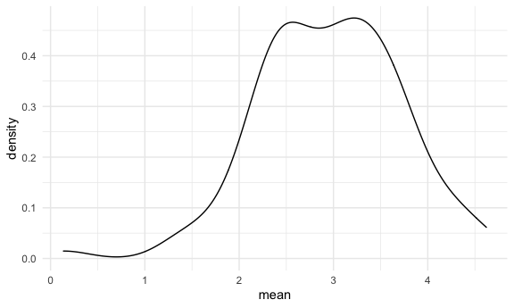
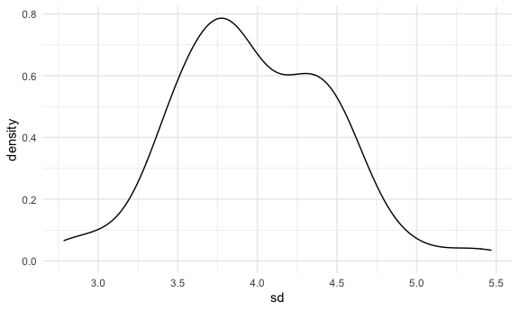

Simulation
================
Saryu Patel
11/10/2021

## Simulate something

``` r
sim_mean_sd = function(samp_size, mu = 3, sigma = 4) {
  sim_data <- tibble(
    x = rnorm(n = samp_size, mean = mu, sd = sigma),
  )
  sim_data %>% 
    summarize(
      mean = mean(x),
      sd = sd(x)
    )
}
```

Simulate by running this line.

``` r
sim_mean_sd(30)
```

    ## # A tibble: 1 × 2
    ##    mean    sd
    ##   <dbl> <dbl>
    ## 1  2.93  4.30

## Simulate a lot

Start with a for loop.

``` r
output <- vector("list", length = 100)

for (i in 1:100) {
  output[[i]] <- sim_mean_sd(samp_size = 30)
}

bind_rows(output)
```

    ## # A tibble: 100 × 2
    ##     mean    sd
    ##    <dbl> <dbl>
    ##  1  3.99  2.94
    ##  2  4.06  3.83
    ##  3  4.07  2.63
    ##  4  2.45  4.21
    ##  5  2.48  3.18
    ##  6  2.42  3.47
    ##  7  3.19  4.27
    ##  8  2.37  3.65
    ##  9  2.28  4.20
    ## 10  3.64  3.32
    ## # … with 90 more rows

Use a loop function.

``` r
sim_results <- 
  rerun(100, sim_mean_sd(30)) %>%
    bind_rows()
```

Look at results.

``` r
sim_results %>% 
  ggplot(aes(x = mean)) +
  geom_density()
```



``` r
sim_results %>% 
  summarize(
    avg_samp_mean = mean(mean),
    sd_sample_mean = sd(mean)
  )
```

    ## # A tibble: 1 × 2
    ##   avg_samp_mean sd_sample_mean
    ##           <dbl>          <dbl>
    ## 1          2.96          0.757

``` r
sim_results %>% 
  ggplot(aes(x = sd)) +
  geom_density()
```


